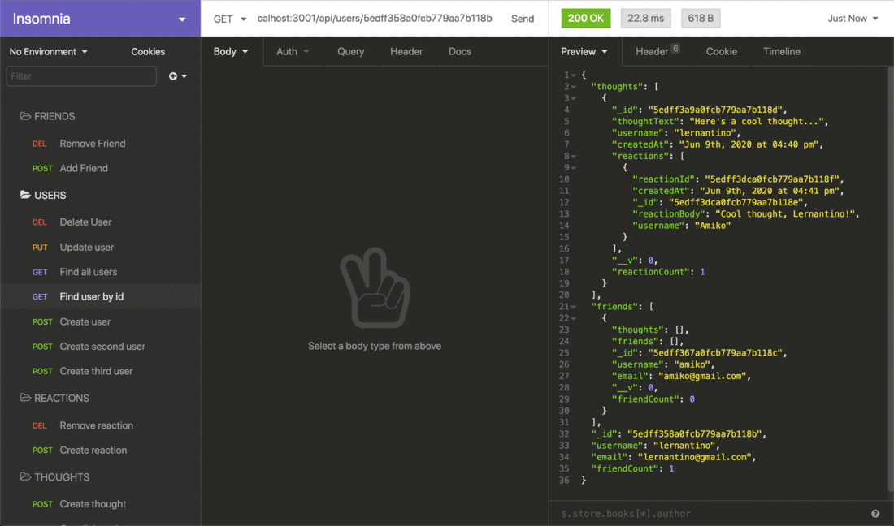

# Module 18 Mini-Project: Student Statistics Back-End

In this activity, you will start with an existing codebase for a mostly complete application.

You will be adding aggregate methods to the `Student` controller to show a student's overall grade and the number of students.

## Instructions

The completed application should meet the following criteria:

- As a user, I want to be able to view all the students and get a total of the number of students enrolled.

- As a user, I want to be able to view a specific student's overall grade in the class using MongoDB operators and their score on each assignment.

- As a user, I want to be able to execute create, read, update, and delete operations on `courses`, `students`, and `assignments`.

### Specifications

The completed application should meet the following specifications:

- The application must make use of a MongoDB database, the Mongoose ODM, and Express.js.

- The database must be seeded with sample data.

- The `Student` controller should have a `headCount` aggregate function to get the total number of students by making use of MongoDB aggregate operators.

- The `Student` controller should have a `grade` aggregate function that returns a single student and also the student's overall grade using MongoDB aggregate operators.

- The project will require research of MongoDB operators such as `$addToSet`, `$unwind`, `$group`, `$match`, and `$avg`.

- `Student` lookup will require use of the `ObjectId()` method.

- The endpoints `api/students/<student id>` and `api/students/` should be tested using Insomnia to ensure that the aggregate functions return the student's overall grade and headcount respectively.

## 💡 Hints

- Be sure to run `npm run seed` to seed your database before testing with Insomnia.

- Run `npm run dev` to have the server automatically restart whenever changes are saved.

- How can we use the `$avg` [MongoDB operator](https://docs.mongodb.com/manual/reference/operator/aggregation/avg/) to calculate the overall grade for a student?

- How can we use the `ObjectId` [Mongoose `Type` method](https://mongoosejs.com/docs/schematypes.html#objectids) to ensure we are able to query a student based on the value in their `_id` field?

## 🏆 Bonus

- What is the difference between Mongoose and MongoDB? What are the advantages and disadvantages of both?

---

© 2024 edX Boot Camps LLC. Confidential and Proprietary. All Rights Reserved.

<!-- Week 18 Challenge Below  -->

# 18 NoSQL: Social Network API

## Your Task

MongoDB is a popular choice for many social networks due to its speed with large amounts of data and flexibility with unstructured data. Over the last part of this course, you’ll use several of the technologies that social networking platforms use in their full-stack applications. Because the foundation of these applications is data, it’s important that you understand how to build and structure the API first.

Your Challenge is to build an API for a social network web application where users can share their thoughts, react to friends’ thoughts, and create a friend list. You’ll use Express.js for routing, a MongoDB database, and the Mongoose ODM. In addition to using the [Express.js](https://www.npmjs.com/package/express) and [Mongoose](https://www.npmjs.com/package/mongoose) packages, you may also optionally use a JavaScript date library of your choice or the native JavaScript `Date` object to format timestamps.

No seed data is provided, so you’ll need to create your own data using Insomnia after you’ve created your API.

Because this application won’t be deployed, you’ll also need to create a walkthrough video that demonstrates its functionality and all of the following acceptance criteria being met. You’ll need to submit a link to the video and add it to the README of your project.

## User Story

```md
AS A social media startup
I WANT an API for my social network that uses a NoSQL database
SO THAT my website can handle large amounts of unstructured data
```

## Acceptance Criteria

```md
GIVEN a social network API
WHEN I enter the command to invoke the application
THEN my server is started and the Mongoose models are synced to the MongoDB database
WHEN I open API GET routes in Insomnia for users and thoughts
THEN the data for each of these routes is displayed in a formatted JSON
WHEN I test API POST, PUT, and DELETE routes in Insomnia
THEN I am able to successfully create, update, and delete users and thoughts in my database
WHEN I test API POST and DELETE routes in Insomnia
THEN I am able to successfully create and delete reactions to thoughts and add and remove friends to a user’s friend list
```

## Mock Up

The following animations show examples of the application's API routes being tested in Insomnia.

The following animation shows GET routes to return all users and all thoughts being tested in Insomnia:


The following animation shows GET routes to return a single user and a single thought being tested in Insomnia:



The following animation shows the POST, PUT, and DELETE routes for users being tested in Insomnia:


In addition to this, your walkthrough video should show the POST, PUT, and DELETE routes for thoughts being tested in Insomnia.

The following animation shows the POST and DELETE routes for a user’s friend list being tested in Insomnia:


In addition to this, your walkthrough video should show the POST and DELETE routes for reactions to thoughts being tested in Insomnia.

## Getting Started

Be sure to have MongoDB installed on your machine. Follow the [MongoDB installation guide on The Full-Stack Blog](https://coding-boot-camp.github.io/full-stack/mongodb/how-to-install-mongodb) to install MongoDB locally.

Use the following guidelines to set up your models and API routes:

### Models

**User**:

- `username`

  - String
  - Unique
  - Required
  - Trimmed

- `email`

  - String
  - Required
  - Unique
  - Must match a valid email address (look into Mongoose's matching validation)

- `thoughts`

  - Array of `_id` values referencing the `Thought` model

- `friends`
  - Array of `_id` values referencing the `User` model (self-reference)

**Schema Settings**:

Create a virtual called `friendCount` that retrieves the length of the user's `friends` array field on query.

---

**Thought**:

- `thoughtText`

  - String
  - Required
  - Must be between 1 and 280 characters

- `createdAt`

  - Date
  - Set default value to the current timestamp
  - Use a getter method to format the timestamp on query

- `username` (The user that created this thought)

  - String
  - Required

- `reactions` (These are like replies)
  - Array of nested documents created with the `reactionSchema`

**Schema Settings**:

Create a virtual called `reactionCount` that retrieves the length of the thought's `reactions` array field on query.

---

**Reaction** (SCHEMA ONLY)

- `reactionId`

  - Use Mongoose's ObjectId data type
  - Default value is set to a new ObjectId

- `reactionBody`

  - String
  - Required
  - 280 character maximum

- `username`

  - String
  - Required

- `createdAt`
  - Date
  - Set default value to the current timestamp
  - Use a getter method to format the timestamp on query

**Schema Settings**:

This will not be a model, but rather will be used as the `reaction` field's subdocument schema in the `Thought` model.

### API Routes

**`/api/users`**

- `GET` all users

- `GET` a single user by its `_id` and populated thought and friend data

- `POST` a new user:

```json
// example data
{
  "username": "lernantino",
  "email": "lernantino@gmail.com"
}
```

- `PUT` to update a user by its `_id`

- `DELETE` to remove user by its `_id`

**BONUS**: Remove a user's associated thoughts when deleted.

---

**`/api/users/:userId/friends/:friendId`**

- `POST` to add a new friend to a user's friend list

- `DELETE` to remove a friend from a user's friend list

---

**`/api/thoughts`**

- `GET` to get all thoughts

- `GET` to get a single thought by its `_id`

- `POST` to create a new thought (don't forget to push the created thought's `_id` to the associated user's `thoughts` array field)

```json
// example data
{
  "thoughtText": "Here's a cool thought...",
  "username": "lernantino",
  "userId": "5edff358a0fcb779aa7b118b"
}
```

- `PUT` to update a thought by its `_id`

- `DELETE` to remove a thought by its `_id`

---

**`/api/thoughts/:thoughtId/reactions`**

- `POST` to create a reaction stored in a single thought's `reactions` array field

- `DELETE` to pull and remove a reaction by the reaction's `reactionId` value

## Grading Requirements

> **Note**: If a Challenge assignment submission is marked as “0”, it is considered incomplete and will not count towards your graduation requirements. Examples of incomplete submissions include the following:
>
> - A repository that has no code
>
> - A repository that includes a unique name but nothing else
>
> - A repository that includes only a README file but nothing else
>
> - A repository that only includes starter code

This Challenge is graded based on the following criteria:

### Deliverables: 10%

- Your GitHub repository containing your application code.

### Walkthrough Video: 37%

- A walkthrough video that demonstrates the functionality of the social media API must be submitted, and a link to the video should be included in your README file.

  - The walkthrough video must show all of the technical acceptance criteria being met.

  - The walkthrough video must demonstrate how to start the application’s server.

  - The walkthrough video must demonstrate GET routes for all users and all thoughts being tested in Insomnia.

  - The walkthrough video must demonstrate GET routes for a single user and a single thought being tested in Insomnia.

  - The walkthrough video must demonstrate POST, PUT, and DELETE routes for users and thoughts being tested in Insomnia.

  - Walkthrough video must demonstrate POST and DELETE routes for a user’s friend list being tested in Insomnia.

  - Walkthrough video must demonstrate POST and DELETE routes for reactions to thoughts being tested in Insomnia.

### Technical Acceptance Criteria: 40%

- Satisfies all of the preceding acceptance criteria plus the following:

  - Uses the [Mongoose package](https://www.npmjs.com/package/mongoose) to connect to a MongoDB database.

  - Includes User and Thought models outlined in the Challenge instructions.

  - Includes schema settings for User and Thought models as outlined in the Challenge instructions.

  - Includes Reactions as the `reaction` field's subdocument schema in the Thought model.

  - Uses functionality to format queried timestamps properly.

### Repository Quality: 13%

- Repository has a unique name.

- Repository follows best practices for file structure and naming conventions.

- Repository follows best practices for class/id naming conventions, indentation, quality comments, etc.

- Repository contains multiple descriptive commit messages.

- Repository contains a high-quality README with description and a link to a walkthrough video.

### Bonus: +10 Points

Fulfilling the following can add up to 10 points to your grade. Note that the highest grade you can achieve is still 100:

- Application deletes a user's associated thoughts when the user is deleted.

## Review

You are required to submit BOTH of the following for review:

- A walkthrough video demonstrating the functionality of the application and all of the acceptance criteria being met.

- The URL of the GitHub repository. Give the repository a unique name and include a README describing the project.

---

© 2024 edX Boot Camps LLC. Confidential and Proprietary. All Rights Reserved.
